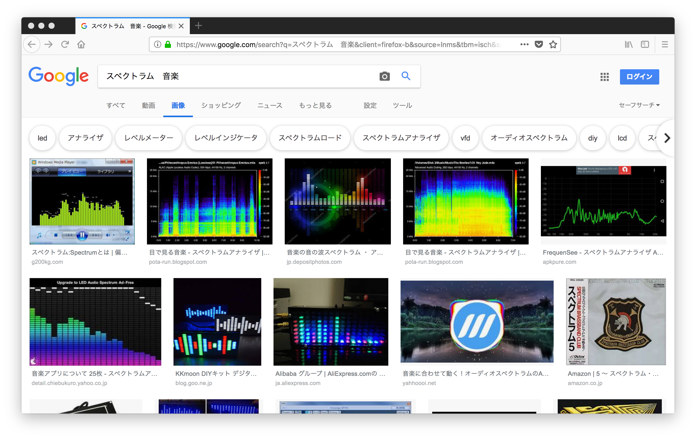
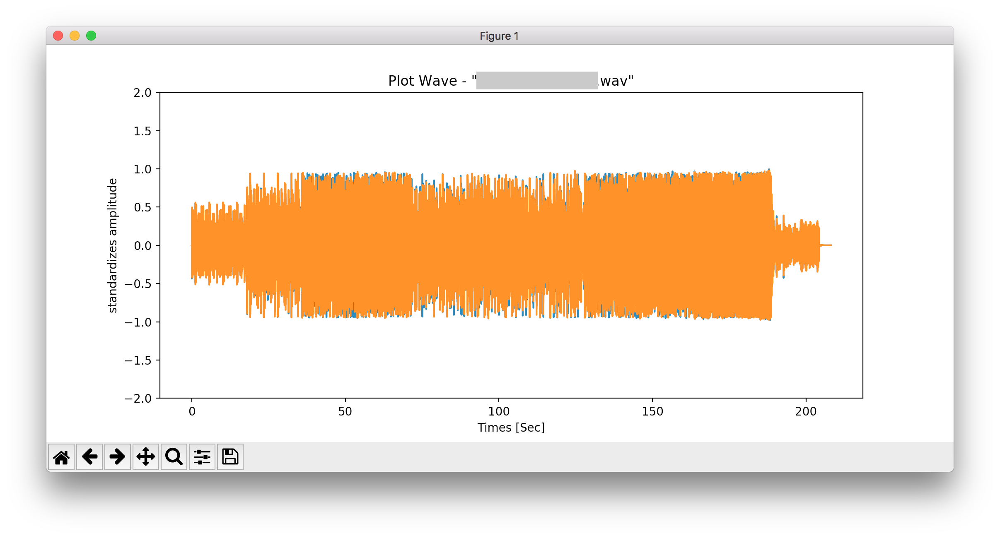
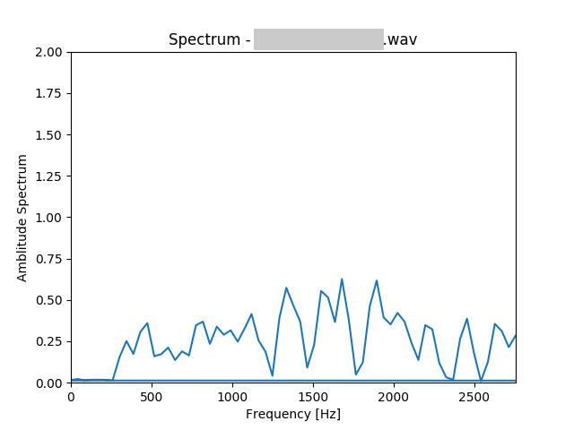
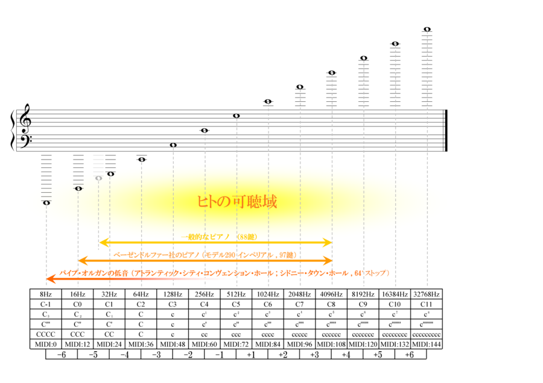
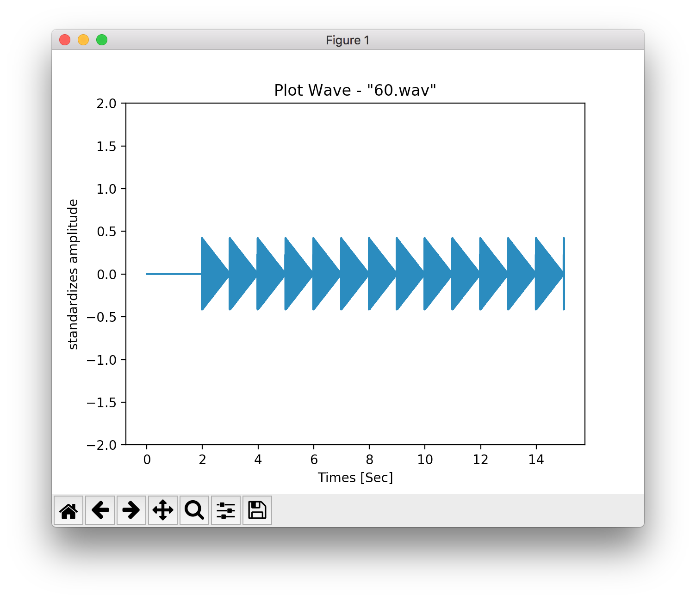
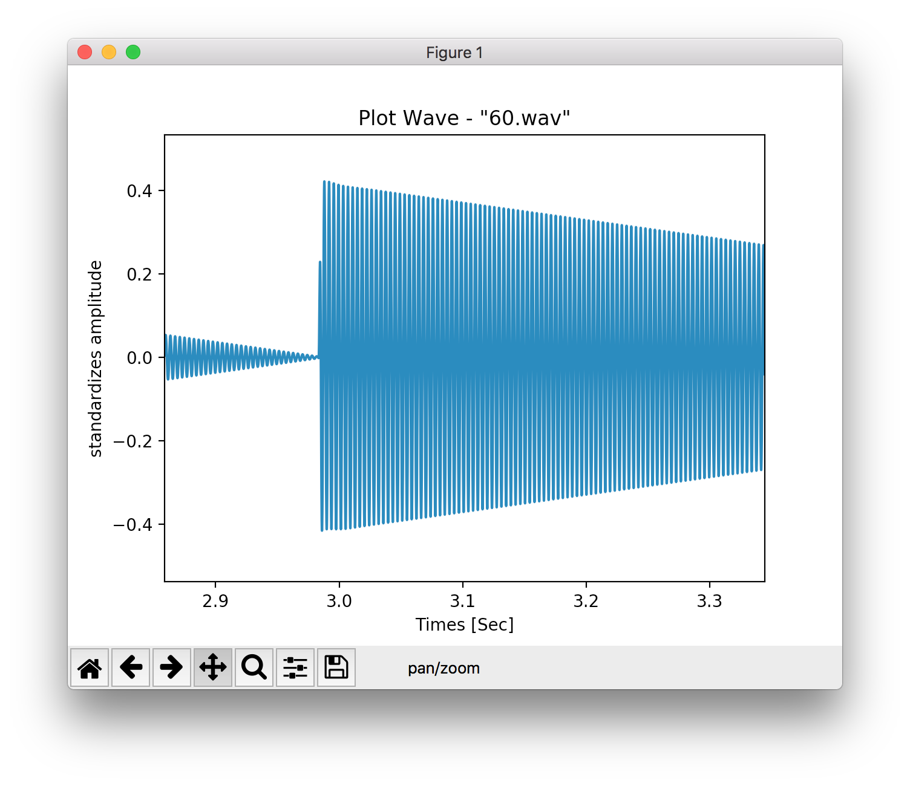
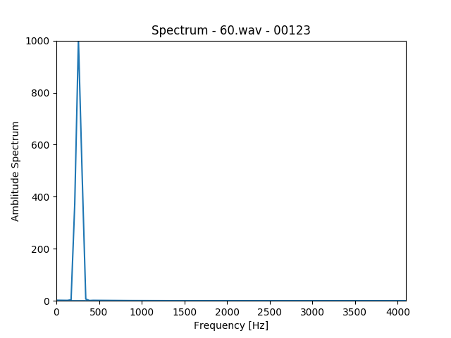

# AnalyzingSound  


最近、映像をちまちま作っている。  

映像と音を同期させた映像を作りたいとか思ったりするので、とりあえず調べる。  

映像と画像の関係は簡単。  
映像は、画像を超高速で差し替えている、離散的な、パラパラ漫画的な  
映像を切り刻んで、連番の画像に。それを繋ぎ直せば戻る  

それと比較して、音声ファイルは、連続的、連続体、もっと連続的に思える  
切り刻んで、繋ぎ直しても元には戻らない？  


---  


### 音と同期した映像の作り方

(1) 周波数解析（Frequency Spectrum, スペクトラム解析？）的なものを噛ませて、それが映像のパラメータになるようにする  
- なんかコードを書く必要がある  
- Python でも解析が出来るぽいのでそれでなんとかする  
  - Python には、.wav 形式の音声ファイルを扱う wave ライブラリがあるので、それで。mp3 → wav は ffmpeg でできる。  
    - pyAudio とかいうのもあるっぽい（リアルタイムで入力する系で使ってる例があった）  
  - Blender（じゃなくても、プリレンダリング系）でやるなら、フレームレートを設定（30 or 24）して、 CSV にまとめて書き出して、キーフレームに打ち込ませる（かな）  
    - ~~Python でフレームレートっていう概念をどうやるかな？？~~
    - 音声ファイルに、フレームがあるので、それを利用して処理できた   
    - ~~Blender-Python で、Pandas 使えれば、この CSV のデータからキーフレーム打ちは、秒で出来る~~  
    - 標準の csv モジュールがつかえたので、秒で出来た  
  - 描画を Python でやるにも、PIL や、OpenCV で描画でフレーム落ちする可能性があるので、一旦 CSV にするのが、多分、吉  
- 音全域で、全部処理されるものを、捨てるところ捨てて、うまく料理しないとけない気がするのでその辺はやってみて...  
    


(2) 手でキーフレームを打つ時に、音に合わせて設定する  
- 面倒臭い  
- 取捨選択をしないといけない。センス大事？耳も大事？  
- 普通に面倒臭い  


---  


### 音声ファイルについて  

print_info.py で出力される結果例  

```python
# Channel : 2
# Width : 2
# Frame Rate : 44100
# Frame num :  9176832
# Tatal Time : 208.09142857142857
# Total Time : 3 min 28.091428571428565 sec
```

44.1kHz  

1 秒間に 44100 回サンプルを取っている  
これで音の上限周波数が決まる。サンプリング周波数の半分の周波数まで記録出来る。  

44100 FPS 的な  


1470 フレームごとに取得できれば、30FPS かな  
```pyton
>>> 44100/30
1470.0
```


---  


### amp の波形  

plot_wave.py で、何か波形が出せた。  
正規化しているので、-1 から 1の範囲になってる  
  


---  


### Spectrum の波形

spectrum.py とりあえず写経  
0フレから1024フレまでの、周波数解析の結果を表示  

（ +matplotlib で、Graph の png 出力できた）
  


上を拡張して spectrum_30_FPS.py  
これを、30FPS ごとに解析するように、書き換えたもの  

これで、1フレーム内で正規化？されていて、前後のフレームで比べるみたいなことができない  
```python
data_max = data_fft/max(abs(data_fft)) # 正規化？
```

正規化しないでも良い  


長さを計算してみると、ffmpeg -i file で出てくる値に近い


----  


### 解析にかける音域  

いまのところ、matplot でプロットしている横軸、0~2756 にしているが（拾ったコードがこうだったので）、あとで情報として使える音域を調べてみる。

Wikipedia の 聴覚 によると

>可聴域  
ヒトでは通常、下は20Hz程度から、上は（個人差があるが）15,000Hzから20,000Hz程度までの鼓膜振動を音として感じることができ、この周波数帯域を可聴域という。可聴域を超えた周波数の音は超音波という。  

  

[https://ja.wikipedia.org/wiki/聴覚](https://ja.wikipedia.org/wiki/%E8%81%B4%E8%A6%9A)


---  


### 音の強さを CSV に書き出す  

plot_wave_csv.py で、解析によって出てきた値を csv に入れた。  

```python
CSV_data = []

temp = str(j) + "," + str(count) + "," + str(data_zero[j]) + ",\n"
# print(temp)

CSV_data.append(temp)

with open(path_csv, mode='w') as f:
    f.writelines(CSV_data)
```

csv  

|**j** |**count** |**amp** |
|--:|--:|--:|
|0|0|0.0|
|1470|1|0.0|
|2940|2|0.0|
|4410|3|0.0|
|5880|4|0.0|
|7350|5|-0.06158447265625|
|8820|6|-0.114013671875|
|10290|7|-0.035675048828125|
|11760|8|0.0908203125|
|13230|9|-0.080963134765625|
|14700|10|-0.02813720703125|
|16170|11|0.137420654296875|
|17640|12|-0.08941650390625|
|19110|13|-0.010498046875|
|20580|14|0.12298583984375|
|...|...|...|  


---  


### CSV を読み込む  

Blender でも、使えるように、Pandas ではなくて、標準の csv モジュールでやる  

Amp_csv_reading_test.py 、読み込みのテストコード  

```python
for i, row in enumerate(reader):
    print(i, row[0], row[1], row[2])
```


---  


### CSV の値を使って、Blender に、キーフレームを打つ  

最低限の雛形として、Amp_csv_Blender.py を書いた  
csv モジュールで、csv が問題なく読めた  

カメラの位置角度等、マテリアルの色とかにアクセスできるようにしたら普通に便利  

データパスをコピーとかでちゃんと調べる  
ex)  
デーフューズ BSDF のノードの色のパス  
nodes["Diffuse BSDF"].inputs[0].default_value  

bpy  

```python
# 値を持ってくる
size = abs(float(row[2]))*1.25 + 0.1

# 値をパラメータに設定
cube.scale.x = size

# キーフレームを打ち込む
cube.keyframe_insert(data_path = "scale", index=0, frame=i)

```

amp だけでは、アニメーションにした結果は、思ってたほど可愛くないので、結構微妙だった。  

ちゃんと音の高さで必要なものだけ、低音のリズムを使うとか工夫が必要っぽい...  


---  


### 純粋な音の素材を用意して、解析してみる  

音を作るのは、Sonic Pi  

これを使う理由は、無料 + 生演奏と違ってコードで書くので再現性の高さが有る、明示的  

- case_1  

  60.wav  
  ドー・ドー・ドー  
  ※ ドは、262Hz  
  ```rb
  live_loop :flibble do
    play 60
    sleep 1
    play 60
    sleep 1
    play 60
    sleep 1
    play 60
    sleep 1
  end
  ```


  plot_wave.py で音の強さをみる  
  かなり綺麗な波形が出た  

    
    

  spectrum_30_FPS.py で、各フレームごとのに、周波数解析  
  あるフレームの解析結果  
    


- case_2  

  60_62_64.wav  
  ドー・レー・ミー・ドー・レー・ミー  
  ```rb
  live_loop :flibble do
    play 60
    sleep 1
    play 62
    sleep 1
    play 64
  end
  ```


---  

---  


### Ref.  


22.4. wave — WAVファイルの読み書き  
[https://docs.python.jp/3/library/wave.html](https://docs.python.jp/3/library/wave.html)  

Pythonで科学計算ライブラリ「numpy」を用いて周波数解析(tomosoft)  
[https://tomosoft.jp/design/?p=11527](https://tomosoft.jp/design/?p=11527)  

Pythonを使って音声データからスペクトログラムを作成する(自調自考の旅)  
[https://own-search-and-study.xyz/2017/10/27/python%E3%82%92%E4%BD%BF%E3%81%A3%E3%81%A6%E9%9F%B3%E5%A3%B0%E3%83%87%E3%83%BC%E3%82%BF%E3%81%8B%E3%82%89%E3%82%B9%E3%83%9A%E3%82%AF%E3%83%88%E3%83%AD%E3%82%B0%E3%83%A9%E3%83%A0%E3%82%92%E4%BD%9C/](https://own-search-and-study.xyz/2017/10/27/python%E3%82%92%E4%BD%BF%E3%81%A3%E3%81%A6%E9%9F%B3%E5%A3%B0%E3%83%87%E3%83%BC%E3%82%BF%E3%81%8B%E3%82%89%E3%82%B9%E3%83%9A%E3%82%AF%E3%83%88%E3%83%AD%E3%82%B0%E3%83%A9%E3%83%A0%E3%82%92%E4%BD%9C/)  

Pythonで音の高速フーリエ変換（FFT）  
[http://denshi.blog.jp/signal_processing/python/fft](http://denshi.blog.jp/signal_processing/python/fft)  

【Python】WAVファイルを等間隔に分割するプログラム【サウンドプログラミング】  
[http://tacky0612.hatenablog.com/entry/2017/11/21/164409](http://tacky0612.hatenablog.com/entry/2017/11/21/164409)  

【Python】複数のWAVファイルの波形を表示するプログラム【サウンドプログラミング】  
[http://tacky0612.hatenablog.com/entry/2017/11/28/133103](http://tacky0612.hatenablog.com/entry/2017/11/28/133103)

【Python】WAVファイルの波形データにFFTかけて周波数スペクトルを複数表示する【サウンドプログラミング】  
[http://tacky0612.hatenablog.com/entry/2017/12/12/174405](http://tacky0612.hatenablog.com/entry/2017/12/12/174405)  

PythonのWaveモジュールを使ってwavファイルを編集する（Qiita）  
情報を表示  
[https://qiita.com/niisan-tokyo/items/d25dada3fa9903862260](https://qiita.com/niisan-tokyo/items/d25dada3fa9903862260)  


